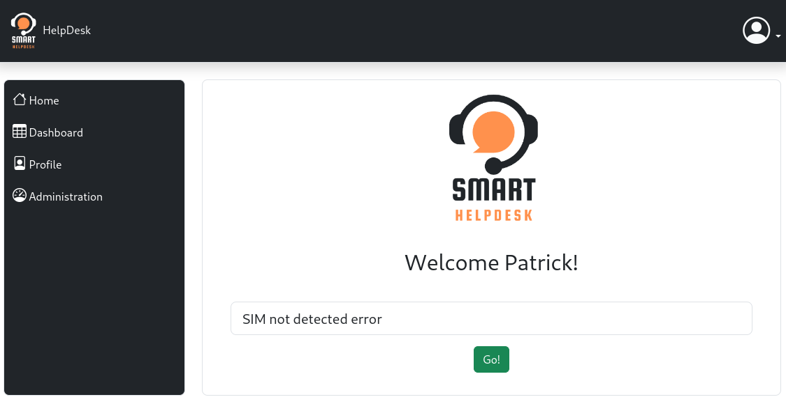
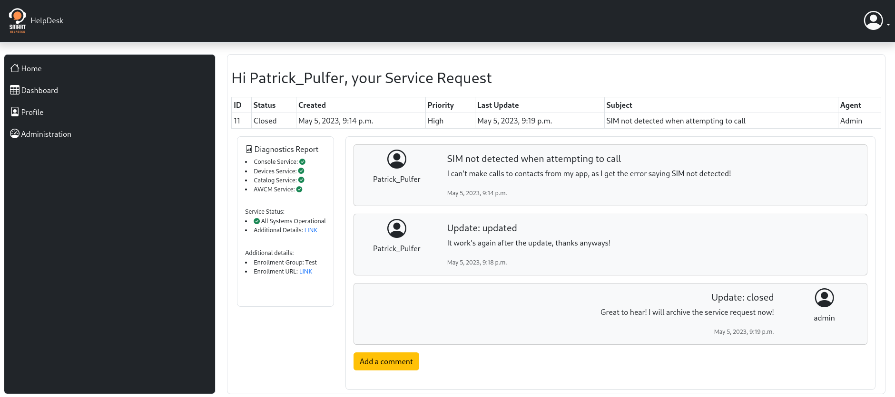

  

## DevOps Pipeline Status

 

 

 

# Smart Help Desk System

This project aims to develop a smarter Help Desk online system to improve the end-user experience,
lower costs in human resources and improve metrics like Time to Resolution (TTR). The system will
automate troubleshooting steps to gather diagnostic data, make this data available for the Help Desk
engineer and suggest possible solutions proactively.

 

## Screenshots

## Technology Used
This application has been built by using the following technologies:

- 
    - Django is a high-level Python web framework that encourages rapid development and clean, pragmatic design.
- 
    - Python is a programming language that lets you work quickly and integrate systems more effectively.
- 
    - [HTML 5](https://www.w3.org/TR/2008/WD-html5-20080122/) / [CSS](https://www.w3.org/Style/CSS/Overview.en.html) / [JavaScript](https://262.ecma-international.org/10.0/index.html)
- [Bootstrap](https://getbootstrap.com/)
  - Front-end framework for web development.

Django Packages
- *Auth for Django
- Beautiful Soup
- Selenium WebDriver
- django-crispy-forms
- crispy-bootstrap5

## Acknowledgements
- I would like to thank [ATU - Atlantic Technological University](https://www.atu.ie/) for the learning experience and all the support provided.
